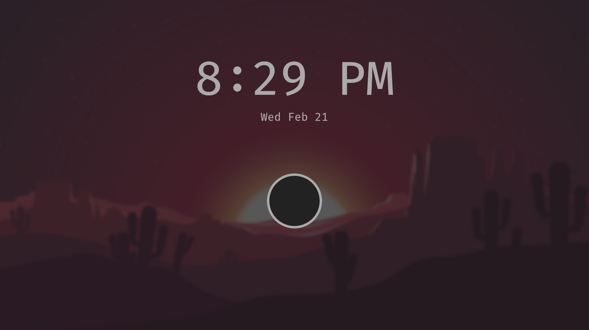
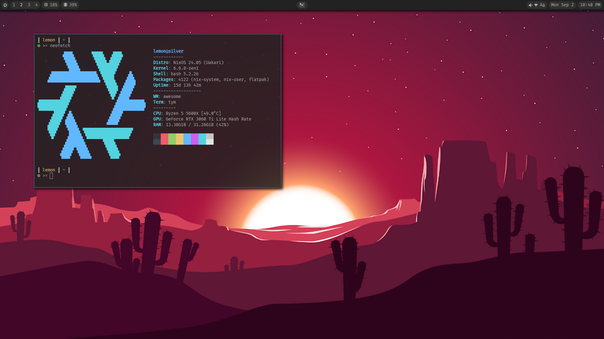
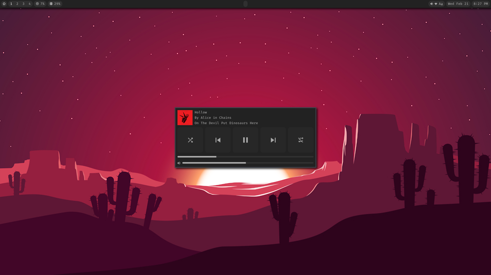

# lemonix  

These are my dotfiles for my NixOS system. I like using Lua so a lot of the configurations in here are Lua. This is for my own organization and preservation so I will not guarantee compatability on other systems. Stuff changes a lot.  

## Features  
- NixOS system flake with Home-Manager. Based around a single user for each host.
- Extensible modules for NixOS and Home-Manager.
- AwesomeWM configuration:
  - Bar + Systray under NixOS icon
  - Lockscreen + PAM authentication
  - Media player
  - Powermenu
  - Resource monitor
  - Wacky little crosshairs for games
  - Playerctl signal
- Tym terminal with Hilbish as the terminal shell.
- Custom color theme for Discord, VSCode, and Obsidian.
- Volantes Cursors
- Papirus Icons

## Gallery
  
  
  
- Powermenu and resource monitor not shown because they are too basic tbh.  
- Images currently may or may not be updated.  

## Install  
You can try to use the Installer.sh script and follow the guide in /other but I will not guarantee that it works because stuff changes so much and I don't often remember to update it. It's also designed for MY use case so you will have to modify stuff to get it to work in your case (Usernames, partitions, etc). <b>I WILL NOT help with this.</b> Issues are still welcome but please do not open any regarding installation.  

