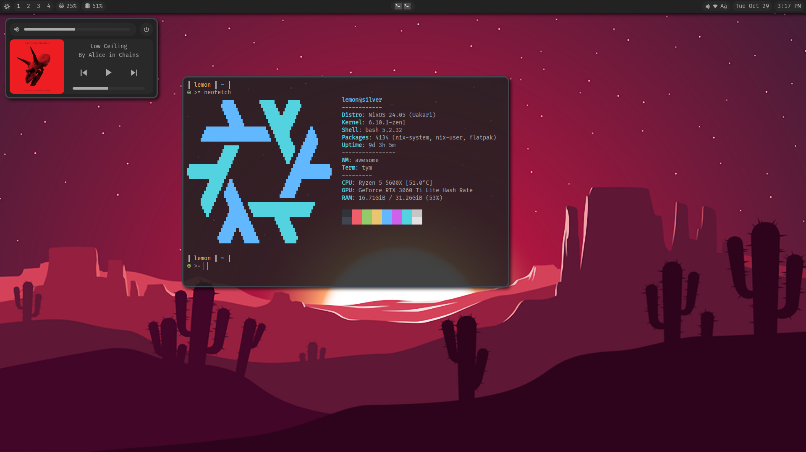

# lemonix
These are my dotfiles for my NixOS system. This is configuration for the stuff I use on a daily basis, so things will ALWAYS be changing.

> [!WARNING]
> This Nix configuration and install items are designed for MY use case. <b>I WILL NOT help with this and I am not responsible for any data loss that occurs from improper installation.</b> Issues are still welcome but please do not open any regarding installation.

## Overview
- NixOS flake with Home-Manager, designed for multiple hosts and users.
- Extensible modules for NixOS and Home-Manager.
- AwesomeWM configuration:
  - Lockscreen + PAM authentication (Supports fprintd)
  - User config (per host) that controls widgets on the bar and control menu.
  - Control menu that supports sliders, powermenu, and a media player.
  - Mpris and various signals for resources, peripherals, and other miscellany.
- Tym terminal with Hilbish shell.
- Custom color theme for AwesomeWM, Lite-XL, Discord, Obsidian, and VSCode. (GTK theme may or may not happen)
- Papirus Icons and Volantes Cursors.
- Configuration for a variety of programs.

## Topology
As is typical for NixOS configurations, I went for a multi-user approach, even though I'm the only user.
The host directory contains configuration for the machine and its hardware, based on NixOS stable. Ideally, it tries to avoid configuring user-space and graphical elements, though some things are simply not available in home-manager.
Similarly, the users directory contains configuration for the users of that machine, based on NixOS unstable. It is entirely configured with home-manager and is the majority of the work in this dotfile repository.
Both hosts and users have a common import which, as the name implies, contains options that each importer would use to reduce code duplication, but can still be overriden if needed.
The modules directory contains common modules that may or may not be imported by the hosts or users. It's rather custom and includes a lot of specific architecture towards this repository so they aren't exposed in the flake.
The other directories just fill in some gaps. Secrets, packages, misc Nix stuff, and other extra things.

## Gallery

- Images updated Oct 29, 2024.

## Install
There is an install script and install guide in [/other](https://github.com/passivelemon/lemonix/tree/master/other) to aid in installation and setup.

