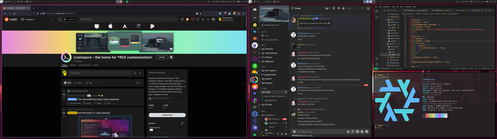

# lemonix  

  
- Image currently may or may not be updated.  

These are my dotfiles for my NixOS system. I like using Lua so a lot of the configurations in here are Lua. This is for my own organization and preservation so I will not guarantee compatability on other systems. Stuff changes a lot.  

## Features  
- NixOS system flake with Home-Manager. Based around a single user for each host.
- Extensible modules. System customization, Spicetify, picom, etc.
- AwesomeWM configuration with Wibar, Naughty and extra UI elements: Music player, powermenu, resource monitor.
- Tym terminal with Hilbish as the terminal shell. Bash is the default user shell and Dash is the system shell.
- Lite XL as the primary editor with plugins and VSCodium for other needs.
- Custom color theme with inspiration from One Dark.
- Rofi theme to match the Awesome theme.
- Discord theme with BetterDiscord CSS.
- Volantes Cursors
- Papirus Icons

## Install  
Use the Installer.sh script and follow the guide in /other. I will not guarantee that it works because stuff changes so much and I don't often remember to update it. It's also designed for MY use case so you will have to modify stuff to get it to work in your case. I WILL NOT help with this.  

